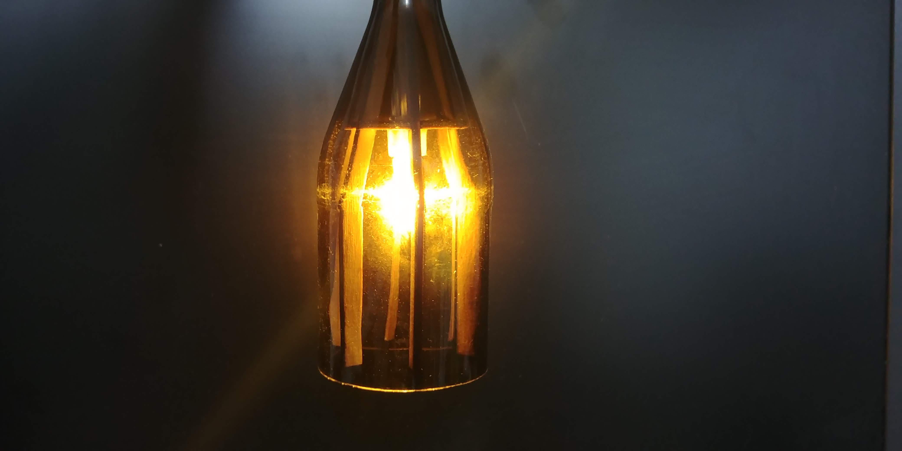

# Sheed lights

Nice looking garden light, powerd by a solar panel, with lightbulbs housing made from bottles and plywood

First prototype : 

## Parts

 - Light bulb housing
 - Circuit housing
 - Circuit
 - Wire T Bingings

## Software used

 - SolveSpace - To draw all the parts
 - InteliJ - To edit any source code
 - Cygwin & Bash - for git, mc, tmux as a reliable productivity tool:
